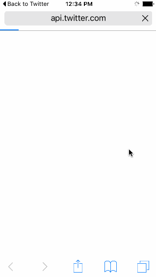

# Week 3 Project - Twitter

Twitter is an application for browsing and interacting with Twitter.

Submitted by: Andrew Duck

Time spent: 11 hours spent in total

## User Stories

The following **required** functionality is complete:

* [x] User can sign in using OAuth login flow
* [x] User can view last 20 tweets from their home timeline
* [x] The current signed in user will be persisted across restarts
* [x] In the home timeline, user can view tweet with the user profile picture, username, tweet text, and timestamp.
* [x] User can pull to refresh
* [x] User can compose a new tweet by tapping on a compose button.
* [x] User can tap on a tweet to view it, with controls to retweet, favorite, and reply.

The following **optional** features are implemented:

* [] When composing, you should have a countdown in the upper right for the tweet limit.
* [] After creating a new tweet, a user should be able to view it in the timeline immediately without refetching the timeline from the network.
* [] Retweeting and favoriting should increment the retweet and favorite count.
* [] User should be able to unretweet and unfavorite and should decrement the retweet and favorite count.
* [] Replies should be prefixed with the username and the reply_id should be set when posting the tweet,
* [] User can load more tweets once they reach the bottom of the feed using infinite loading similar to the actual Twitter client.

The following **extra** features are implemented: 

* [x] Implement timer for automatic refresh of feed every 90 seconds. 
* [x] Implemented Twitter branding colours, logos and icons at 1x, 2x, 3x sizes from original SVG files in branding guide, included Twitter fonts.

## Video Walkthrough 

GIF created with [LiceCap](http://www.cockos.com/licecap/).

## Notes

[Bug] If you reply to a tweet, then try to create a new tweet, the reply is still active. Havent' had time to fix. 
[Bug] If you like a tweet, the coloured icon used persists to the resusable cell, not to the record, so it shows more than once. Needs to be fixed. 
[Not implemented] Updating Retweet icon on retweet.

## License

Copyright [2016] [Andrew Duck]

Licensed under the Apache License, Version 2.0 (the "License");
you may not use this file except in compliance with the License.
You may obtain a copy of the License at

http://www.apache.org/licenses/LICENSE-2.0

Unless required by applicable law or agreed to in writing, software
distributed under the License is distributed on an "AS IS" BASIS,
WITHOUT WARRANTIES OR CONDITIONS OF ANY KIND, either express or implied.
See the License for the specific language governing permissions and
limitations under the License.
